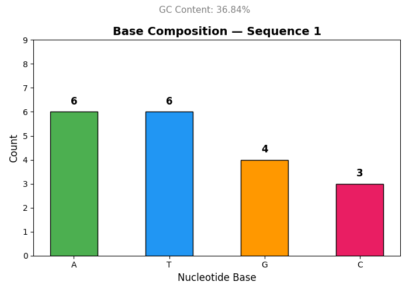
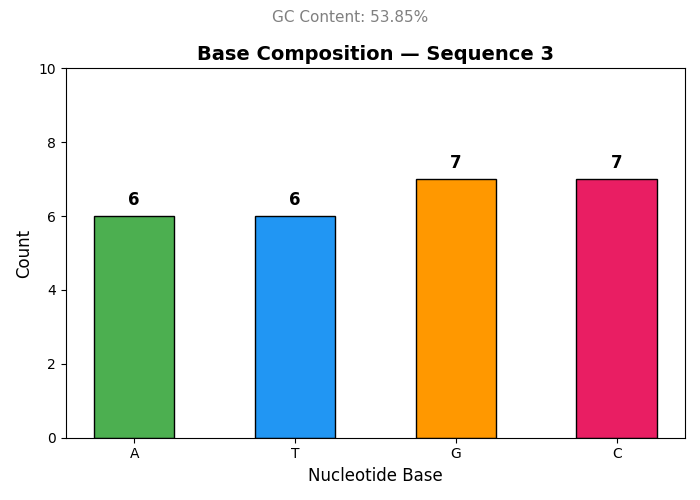
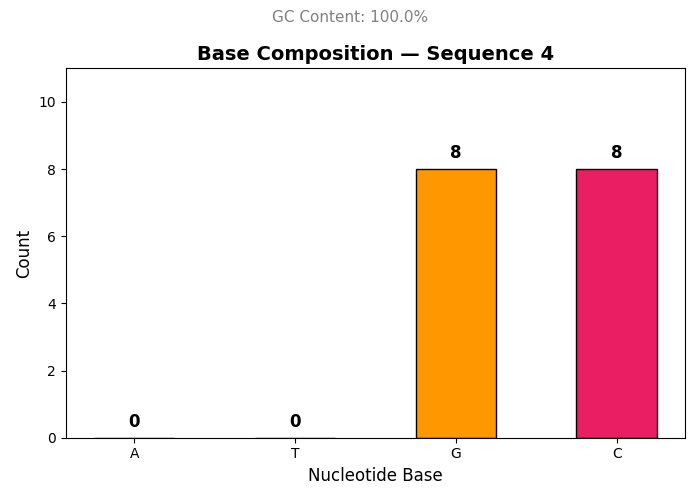

# 🧬 DNA Sequence Analyzer


A beginner bioinformatics tool that analyzes DNA sequences using Python.
Built as **Phase 1** of a bioinformatics-to-tech portfolio journey! 🚀

---

## 📌 Features
- ✅ Validates DNA sequences (A, T, G, C only)
- ✅ Counts each nucleotide base (A, T, G, C)
- ✅ Calculates GC content percentage
- ✅ Calculates AT/GC ratio
- ✅ Generates complement and reverse complement
- ✅ Colorful bar chart visualization using Matplotlib
- ✅ Analyzes multiple sequences in one session
- ✅ Auto-saves results to a timestamped text file
- ✅ Detects invalid sequences gracefully

---

## 🛠️ Tech Stack
| Tool | Purpose |
|------|---------|
| Python 3.13 | Core programming |
| Matplotlib | Data visualization |
| VS Code | Code editor |
| Git + GitHub | Version control |

---

## ⚙️ Installation

Clone the repository:
```bash
git clone https://github.com/YOUR_USERNAME/dna-sequence-analyzer.git
cd dna-sequence-analyzer
```

Install dependencies:
```bash
pip install matplotlib
```

---

## ▶️ Usage
```bash
python dna_analyzer.py
```
Enter any DNA sequence when prompted. Type `done` when finished.

---

## 🧪 Sample Output
```
Sequence            : ATGCGCTAGCTAGCTAGCATGCATGC
Length              : 26 bases
Base Counts         : A=6  T=6  G=7  C=7
GC Content          : 53.85%
AT/GC Ratio         : 0.86
Complement          : TACGCGATCGATCGATCGTACGTACG
Reverse Complement  : GCATGCATGCTAGCTAGCTAGCGCAT
Interpretation      : Balanced GC content
```

---

## 📊 Output Charts

### Sequence 1 — AT-rich region (GC: 36.84%)


### Sequence 3 — Balanced GC content (GC: 53.85%)


### Sequence 4 — GC-rich region (GC: 100%)


---

## 🗺️ Project Roadmap
- [x] Phase 1 — DNA Sequence Analyzer ✅
- [ ] Phase 2 — DNA → RNA Transcriber
- [ ] Phase 3 — FASTA File Parser
- [ ] Phase 4 — Mutation Detector
- [ ] Phase 5 — Full Bioinformatics Pipeline
- [ ] Phase 6 — Web Dashboard

---

## 👩‍💻 Author
**Padma Shree**
Bioinformatics + Tech Enthusiast | Python | R | Bash

---

## 📄 License
MIT License — feel free to use and build on this! 😊
